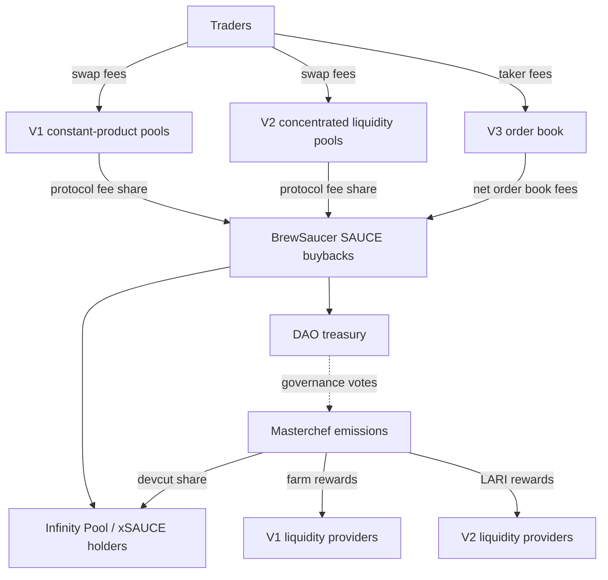

SaucerSwap is a decentralized exchange on the Hedera network. It combines three trading venues — the V1 constant-product AMM, the V2 concentrated-liquidity AMM, and the V3 order book — with a shared token economy built around SAUCE. Every venue feeds protocol fees into SAUCE buybacks, and the SaucerSwap DAO steers how emissions and treasury flows are allocated.

## Tokens on Hedera

Every asset on SaucerSwap is a Hedera Token Service (HTS) token. HBAR itself is not an HTS token, so the protocol wraps it into WHBAR behind the scenes; you always see plain HBAR in the interface. Before your account can hold a new token, Hedera requires a one-time token association, which the web app prompts for automatically.

## Three trading venues

| Venue | Model | Best for |
| --- | --- | --- |
| [SaucerSwap V1](/protocol/saucerswap-v1) | Constant-product AMM (Uniswap V2 style) | Legacy pools and long-tail pairs |
| [SaucerSwap V2](/protocol/saucerswap-v2) | Concentrated-liquidity AMM (Uniswap V3 style) | Capital-efficient liquidity provision |
| [SaucerSwap V3](/protocol/saucerswap-v3) | Central limit order book with on-chain settlement | Limit orders and CEX-style trading |

When you swap in the web app, [routing](/protocol/routing) compares the available paths and quotes the trade for you — you do not need to pick a venue. On the trade page, V3 orders can also settle against AMM liquidity when that improves execution.

## Fees and buybacks

Traders pay a fee on every trade: a percentage of each AMM swap, or a taker fee on order book fills. Most of each AMM fee goes to liquidity providers, while the protocol's share — and net V3 order book fees — funds SAUCE buybacks through the BrewSaucer contract. Buyback proceeds are distributed to xSAUCE holders and the DAO treasury, with a burn allocation introduced alongside V3. See [V3 fees and rebates](/protocol/saucerswap-v3/fees) and [SAUCE tokenomics](/tokenomics/overview) for the full flow.

## Liquidity incentives

The Masterchef contract mints SAUCE on a fixed schedule and distributes it as liquidity incentives:

- **V1 yield farm** — LP token stakers earn SAUCE (and, when enabled, HBAR) according to [farm weights](/protocol/saucerswap-v1/farm-weights) set by governance.
- **V2 LARI** — the Liquidity-Aligned Reward Initiative rewards V2 positions automatically each two-week epoch, weighted by in-range liquidity. See [LARI weights](/protocol/saucerswap-v2/lari-weights).

## Single-sided staking

Staking SAUCE in the Infinity Pool issues xSAUCE, a receipt token whose SAUCE conversion rate rises over time as fee revenue, emissions, and HBAR staking rewards compound into the pool. xSAUCE also carries voting power and unlocks V3 fee discounts. See [Single-sided staking](/protocol/single-sided-staking).

## Governance

SAUCE and xSAUCE holders govern the protocol through token-weighted, on-chain voting: proposals start as a Request for Comment on the [governance forum](https://gov.saucerswap.finance/), then advance through Proposal and Election votes on the web app's govern page. The DAO controls farm weights, LARI campaigns, pool creation, tokenomics changes, and treasury flows. See [Governance](/governance/overview).

## Read more

<CardGroup cols={2}>
  <Card title="Swap tutorial" icon="arrow-right-arrow-left" href="/tutorials/swap">
    Make your first swap in the web app, step by step.
  </Card>
  <Card title="SaucerSwap V3" icon="book-open" href="/protocol/saucerswap-v3">
    Understand the order book: off-chain matching, on-chain settlement, and order types.
  </Card>
  <Card title="Single-sided staking" icon="layer-group" href="/protocol/single-sided-staking">
    Stake SAUCE for xSAUCE and earn a share of protocol revenue.
  </Card>
  <Card title="SAUCE tokenomics" icon="coins" href="/tokenomics/overview">
    Supply, emissions, and how protocol fees flow back to SAUCE.
  </Card>
</CardGroup>
