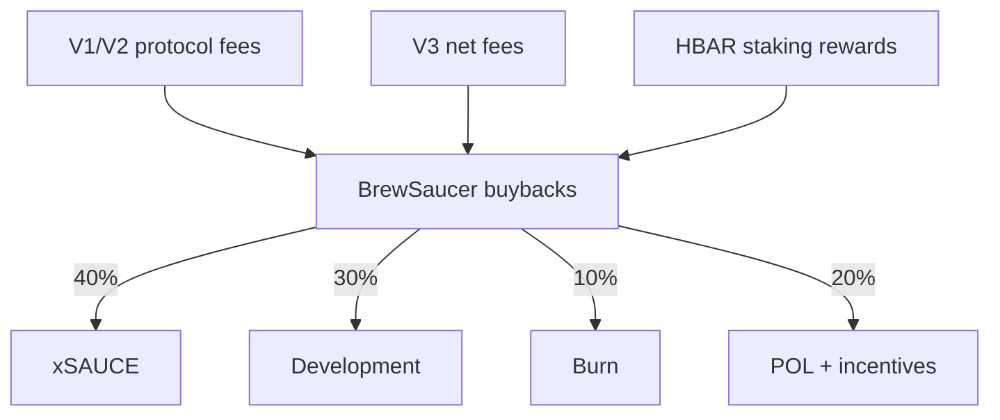
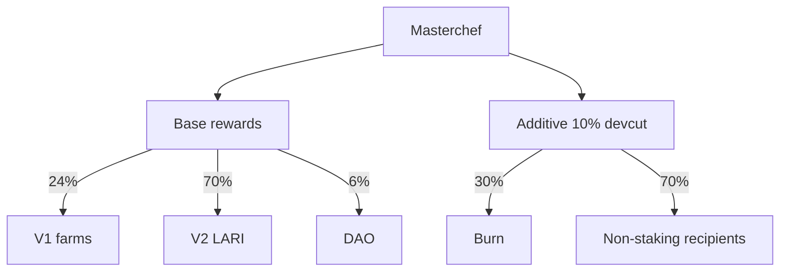

SaucerSwap is a decentralized exchange on the Hedera network. It combines three trading venues — the V1 constant-product AMM, the V2 concentrated-liquidity AMM, and the V3 order book — with a shared token economy built around SAUCE. Every venue feeds protocol fees into SAUCE buybacks, and the SaucerSwap DAO steers how emissions and treasury flows are allocated.

```mermaid
flowchart TD
  AMM[V1/V2 protocol fees] --> B[BrewSaucer buybacks]
  V3[V3 net fees] --> B
  H[HBAR staking rewards] --> B
  B -->|40%| IP[xSAUCE]
  B -->|30%| DEV[Development]
  B -->|10%| BURN[Burn]
  B -->|20%| POL[POL + incentives]
```

## Tokens on Hedera

SaucerSwap supports Hedera Token Service (HTS) tokens and supported ERC-20 assets. HTS tokens require token association before your account can hold them; ERC-20 tokens use a different allowance model. HBAR is the network's native currency, with WHBAR used where a contract requires a token representation. Check the market's token identifiers and see [ERC-20 tokens and wrapping](/tutorials/erc20-wrapping) before choosing a token version.

## Three trading venues

| Venue | Model | Best for |
| --- | --- | --- |
| [SaucerSwap V1](/protocol/saucerswap-v1) | Constant-product AMM (Uniswap V2 style) | Legacy pools and long-tail pairs |
| [SaucerSwap V2](/protocol/saucerswap-v2) | Concentrated-liquidity AMM (Uniswap V3 style) | Capital-efficient liquidity provision |
| [SaucerSwap V3](/protocol/saucerswap-v3) | Central limit order book with on-chain settlement | Limit orders and CEX-style trading |

When you swap in the web app, [routing](/protocol/routing) compares the best V1/V2 AMM quote with an eligible V3 order-book quote and selects one venue for your trade. On the separate **trade** page, you can place and manage V3 orders; eligible orders can also use AMM-backed settlement.

## Fees and buybacks

AMM swaps incur a percentage fee. V3 applies market- and account-specific fees to fills, with eligible makers receiving rebates funded by taker fees. Most of each AMM fee goes to liquidity providers, while protocol fee-switch revenue and net V3 fees fund SAUCE buybacks through BrewSaucer.

Unified BrewSaucer routes purchased SAUCE consistently across eligible revenue sources: 40% to xSAUCE, 30% to development, 10% to burn, and 20% to protocol-owned liquidity and incentives. See [SAUCE tokenomics](/tokenomics/overview) for the full allocation.

## Liquidity incentives

The Masterchef contract mints base rewards at 1.056992 SAUCE/sec under the [Phase 1 allocation](/tokenomics/overview#phase-1-allocation), a 50% reduction from the previous rate:

- **V1 yield farm** — LP token stakers earn SAUCE (and, when enabled, HBAR) according to [farm weights](/protocol/saucerswap-v1/farm-weights) set by governance.
- **V2 LARI** — the Liquidity-Aligned Reward Initiative rewards V2 positions automatically each two-week epoch, weighted by in-range liquidity. See [LARI weights](/protocol/saucerswap-v2/lari-weights).

```mermaid
flowchart TD
  MC[Masterchef] --> BASE[Base rewards]
  MC --> DC[Additive 10% devcut]
  BASE -->|24%| V1[V1 farms]
  BASE -->|70%| V2[V2 LARI]
  BASE -->|6%| DAO[DAO]
  DC -->|30%| BURN[Burn]
  DC -->|70%| OTHER[Non-staking recipients]
```

## Single-sided staking

Staking SAUCE in the Infinity Pool issues xSAUCE, a receipt token whose SAUCE conversion rate rises over time as its share of revenue-funded SAUCE buybacks compounds into the pool. xSAUCE also carries voting power and unlocks V3 fee discounts. See [Single-sided staking](/protocol/single-sided-staking).

## Governance

SAUCE and xSAUCE holders govern the protocol through token-weighted, on-chain voting: proposals start as a Request for Comment on the [governance forum](https://gov.saucerswap.finance/), then advance through Proposal and Election votes on the web app's govern page. The DAO controls farm weights, LARI campaigns, pool creation, tokenomics changes, and treasury flows. See [Governance](/governance/overview).

## Read more

<CardGroup cols={2}>
  <Card title="Swap tutorial" icon="arrow-right-arrow-left" href="/tutorials/swap">
    Make your first swap in the web app, step by step.
  </Card>
  <Card title="SaucerSwap V3" icon="book-open" href="/protocol/saucerswap-v3">
    Understand the order book: off-chain matching, on-chain settlement, and order types.
  </Card>
  <Card title="Single-sided staking" icon="layer-group" href="/protocol/single-sided-staking">
    Stake SAUCE for xSAUCE and earn a share of protocol revenue.
  </Card>
  <Card title="SAUCE tokenomics" icon="coins" href="/tokenomics/overview">
    Supply, emissions, and how protocol fees flow back to SAUCE.
  </Card>
</CardGroup>
